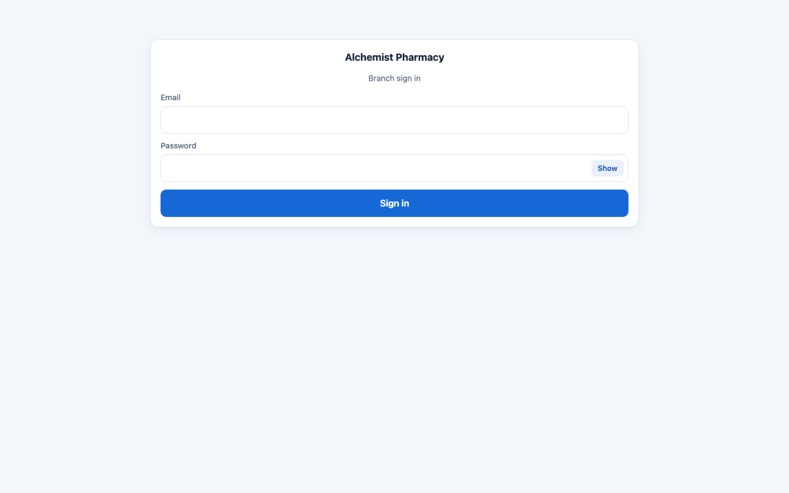
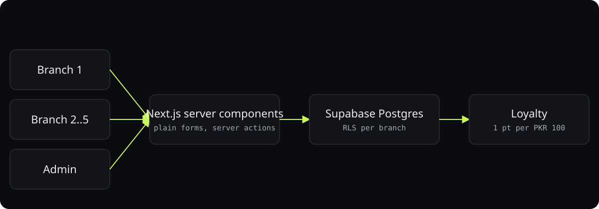

<div align="center">



# Alchemist customer database

**Customer capture and loyalty for a five-branch pharmacy, built to work on slow connections.**

<p>
<a href="https://alchemist-portal.vercel.app"></a>
<a href="https://ibiraheel.com/p/alchemist-customer-db"></a>
</p>

<p>


</p>

</div>

<br>

> **Purchase captured in seconds, points pooled across branches**  
> for Alchemist Pharmacy's branch staff and admin

## What it did

Phone number finds or creates the customer, amount records the sale, 1 point per PKR 100 accrues org-wide. Each branch sees only its own sales through Postgres row-level security; admin sees all. Near-zero client JavaScript.

<sub>Outcome: reported by the owner.</sub>

## How it works

<p align="center"></p>

1. Server Components and plain HTML forms so pages work on a flaky connection.
2. Four dependencies total; no UI framework, system fonts.
3. RLS policies enforce per-branch isolation in the database, not the app.
4. No line-item data stored: privacy by design; inactive customers purged after five years.

## What it does

- **Capture** a purchase in seconds: phone → find/create customer → amount →
  record. No line-item/drug data (privacy by design).
- **Loyalty** (org-wide): earn **1 point per PKR 100**; redeem **1 point = PKR 1**,
  minimum **100 points**; no expiry, no tiers. Points pool across all branches.
- **Per-branch isolation**: one login per branch; a branch sees/records only its
  own sales, but can look up **any** customer by phone. Enforced by Postgres RLS.
- **Reports**: each branch sees its own sales; **admin** sees per-branch +
  combined.
- **Retention**: customers inactive for 5 years are purged (scheduled job).

## Stack & bundle

Dependencies are deliberately minimal: `next`, `react`, `@supabase/ssr`,
`@supabase/supabase-js`. No Tailwind/component library. Almost every route is a
Server Component; mutations use Server Actions (form POST), so pages work even
on a flaky connection.

## First-time setup

1. **Create a Supabase project** — region **Mumbai (ap-south-1)** (closest to
   Lahore; see the privacy memo for the localization rationale).
2. **Run the migrations** in order (SQL editor or Supabase CLI):
   `supabase/migrations/0001_schema.sql` → `0002_functions_rls.sql` →
   `0003_seed.sql` → `0004_reporting.sql` → `0005_retention.sql`.
3. **Bootstrap the first admin** (one time):
   - Supabase → Authentication → Add user (set an email + password).
   - Copy that user's UUID, then in the SQL editor:
     ```sql
     insert into public.profiles (id, role) values ('<that-uuid>', 'admin');
     ```
   - You can now sign in and create branches + branch logins from **/admin**.
4. **(Optional) Enable the retention schedule** — Database → Extensions → enable
   `pg_cron`, then run the `cron.schedule(...)` call in `0005_retention.sql`.
5. **Environment** — copy `.env.example` to `.env.local` and fill in
   `NEXT_PUBLIC_SUPABASE_URL`, `NEXT_PUBLIC_SUPABASE_ANON_KEY`, and
   `SUPABASE_SERVICE_ROLE_KEY` (API settings). The service-role key is used
   only server-side for branch-login provisioning.

## Run locally

```bash
npm install
npm run dev        # http://localhost:3000
```

## Deploy (Vercel)

Import the repo, set the three env vars in the Vercel project, deploy. No other
configuration needed.

## Security model (summary)

- All access rules live in **Postgres RLS** (`0002_functions_rls.sql`), not just
  the app — they hold even if the UI has a bug.
- Branches read the org-wide customer/loyalty directory; they can **write
  purchases only for their own branch**; the loyalty ledger is written **only**
  by the earn trigger and the `redeem_points()` function (never directly).
- `redeem_points()` locks the customer's ledger rows, so a balance can never go
  negative under concurrent redemptions.
- The service-role key never reaches the browser.

## Privacy

No drug/line-item data is stored anywhere (there is no such column), keeping this
system out of "sensitive/health data" scope. Consent is captured at enrollment.
See `../../01_requirements/output/privacy-pakistan.md`. Confirm with local counsel
before go-live (Release gate).

---

<div align="center">

<sub>Built by <a href="https://github.com/ibi-raheel">Muhammad Ibrahim Raheel</a> · more work at <a href="https://ibiraheel.com">ibiraheel.com</a></sub>

</div>
